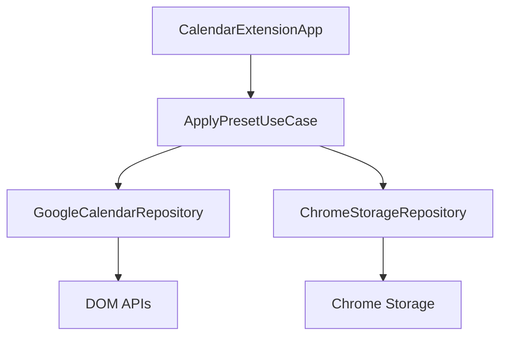
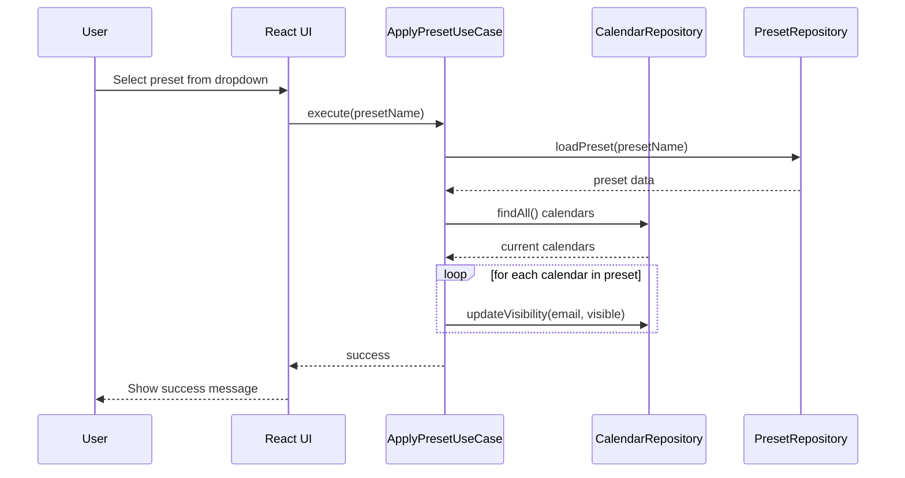
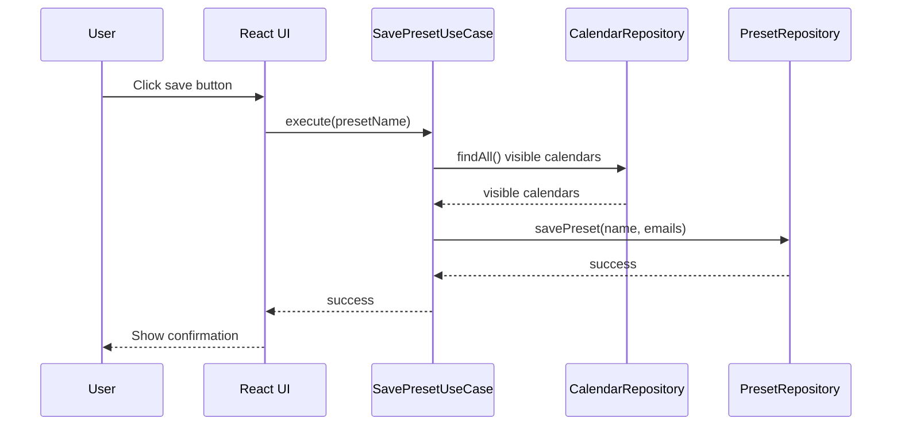
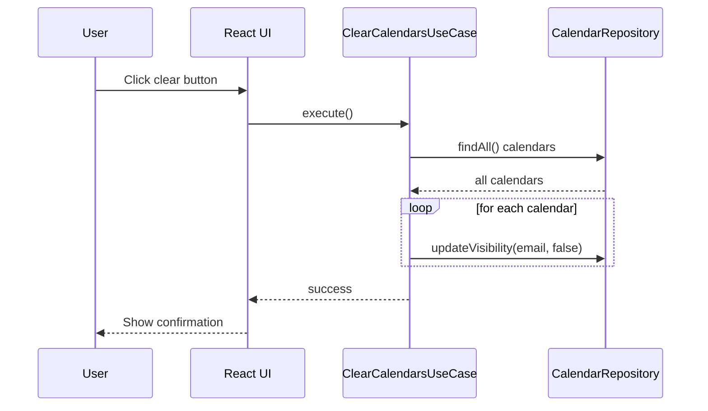
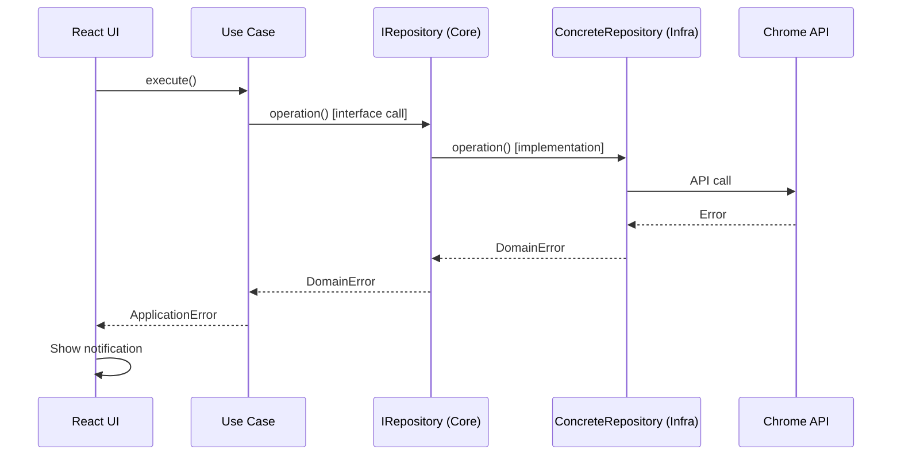

# Lens for Google Calendar Fullstack Architecture Document

## Introduction

This document outlines the complete fullstack architecture for Lens for Google Calendar, including backend systems, frontend implementation, and their integration. It serves as the single source of truth for AI-driven development, ensuring consistency across the entire technology stack.

This unified approach combines what would traditionally be separate backend and frontend architecture documents, streamlining the development process for modern fullstack applications where these concerns are increasingly intertwined.

### Starter Template or Existing Project
N/A - Greenfield project

### Change Log

| Date | Version | Description | Author |
|------|---------|-------------|--------|
| November 21, 2025 | 1.0 | Initial architecture document creation | Winston |

## High Level Architecture

### Technical Summary
The Lens for Google Calendar is a Chrome Manifest V3 extension built with TypeScript, React, and Ant Design, following Domain-Driven Design principles with Clean Architecture. The frontend consists of a React application injected into Google Calendar's UI via content scripts, while the backend is handled by a service worker for extension lifecycle and background tasks. Integration occurs through Chrome storage APIs for data persistence and DOM manipulation for calendar interaction, ensuring reliable state management without external servers.

This architecture achieves PRD goals by providing a seamless, integrated experience within Google Calendar, minimizing disruptions and ensuring long-term compatibility through abstracted Chrome API usage.

### Platform and Infrastructure Choice
**Platform:** Chrome Extension Manifest V3
**Key Services:** Chrome Storage Sync, DOM APIs, Background Service Worker
**Deployment Host and Regions:** Chrome Web Store (global)

### Repository Structure
**Structure:** Monorepo
**Monorepo Tool:** N/A (simple structure)
**Package Organization:** Core (domain), Infrastructure (Chrome), Presentation (React)

### High Level Architecture Diagram
```mermaid
graph TD
    A[User] --> B[Content Script (React UI)]
    B --> C[Google Calendar DOM]
    B --> D[Service Worker]
    D --> E[Chrome Storage Sync]
    D --> F[Chrome APIs]
```

### Architectural Patterns
- **Domain-Driven Design:** Separates business logic from infrastructure for maintainability
- **Repository Pattern:** Abstracts data access to enable testing and future changes
- **Event-Driven Architecture:** Loose coupling via domain events for decoupled communication
- **Clean Architecture:** Dependency inversion for testability and flexibility

## Tech Stack

### Technology Stack Table

| Category | Technology | Version | Purpose | Rationale |
|----------|------------|---------|---------|-----------|
| Frontend Language | TypeScript | 5.5.3 | Type safety and modern JS | Standard for React apps, matches existing codebase |
| Frontend Framework | React | 19.2.0 | UI library | Component-based UI for extension |
| UI Component Library | Ant Design | 5.28.0 | Consistent UI components | Professional look, matches PRD |
| State Management | React Hooks | N/A | Local state management | Sufficient for simple extension needs |
| Backend Language | TypeScript | 5.5.3 | Type safety | Consistent with frontend |
| Backend Framework | Chrome APIs | N/A | Extension APIs | No additional framework needed |
| API Style | N/A | N/A | No API | Extension-only, no REST/GraphQL |
| Database | Chrome Storage Sync | N/A | Data persistence | PRD requirement for cross-device sync |
| Cache | N/A | N/A | No caching | Simple storage, no performance needs |
| File Storage | Chrome Storage | N/A | Config storage | Built-in Chrome API |
| Authentication | N/A | N/A | No auth | Not required for extension |
| Frontend Testing | Jest | 29.7.0 | Unit testing | Existing test setup |
| Backend Testing | Jest | 29.7.0 | Unit testing | Existing test setup |
| E2E Testing | N/A | N/A | No E2E | Not specified in PRD |
| Build Tool | Vite | 7.1.12 | Build and dev | Modern, fast bundler for extensions |
| Bundler | Vite | 7.1.12 | Bundling | Integrated with build tool |
| IaC Tool | N/A | N/A | No infra | No infrastructure to manage |
| CI/CD | GitHub Actions | N/A | Automated build, release, and Chrome Web Store staging | Enables reliable deployment pipeline for extension updates |
| Monitoring | N/A | N/A | No monitoring | Simple extension, no need |
| Logging | loglevel | 1.9.2 | Logging | Existing logging library |
| CSS Framework | Ant Design | 5.28.0 | Styling | Integrated with UI library |

## Data Models

### Calendar Entity
**Purpose:** Represents an individual Google Calendar with its visibility state, serving as the core domain object for calendar management operations.

**Key Attributes:**
- email: string - Unique identifier for the calendar
- name: string - Display name of the calendar
- isVisible: boolean - Current visibility state

**TypeScript Interface:**
```typescript
interface CalendarState {
  email: string;
  name: string;
  isVisible: boolean;
}

class Calendar {
  private readonly _state: CalendarState;

  constructor(state: CalendarState) {
    this._state = { ...state };
  }

  // Getters and business methods
  show(): Calendar { /* return new instance */ }
  hide(): Calendar { /* return new instance */ }
  toggle(): Calendar { /* return new instance */ }
}
```

**Relationships:**
- Referenced by CalendarPreset entities

### CalendarPreset Entity
**Purpose:** Represents a named collection of calendar visibility states, allowing users to save and restore custom calendar groupings.

**Key Attributes:**
- name: string - Unique identifier and display name
- calendarEmails: string[] - Array of calendar email addresses in the preset

**TypeScript Interface:**
```typescript
interface PresetState {
  name: string;
  calendarEmails: string[];
}

class CalendarPreset {
  private readonly _state: PresetState;

  constructor(name: string, calendarEmails: string[]) {
    // initialization
  }

  // Business methods
  addCalendar(email: string): CalendarPreset { /* return new */ }
  removeCalendar(email: string): CalendarPreset { /* return new */ }
}
```

**Relationships:**
- References multiple Calendar entities

## API Specification
N/A - Extension uses only Chrome built-in APIs with no external service integrations.

## Components

### CalendarRepository
**Responsibility:** Abstract interface for calendar data access, enabling dependency injection and testability.

**Key Interfaces:**
- findAll(): Promise<Calendar[]>
- updateVisibility(email: string, visible: boolean): Promise<void>

**Dependencies:** None (interface)

**Technology Stack:** TypeScript interface

### GoogleCalendarRepository
**Responsibility:** Concrete implementation for interacting with Google Calendar's DOM to discover and manipulate calendar visibility.

**Key Interfaces:**
- findAll(): Discovers calendars via DOM selectors
- updateVisibility(): Scrolls and toggles checkboxes

**Dependencies:** VirtualScrollHandler, DOMUtils

**Technology Stack:** TypeScript, Chrome DOM APIs

### ChromeStorageRepository
**Responsibility:** Handles persistence of presets using Chrome storage sync API.

**Key Interfaces:**
- savePreset(): Stores preset data
- loadPresets(): Retrieves all presets
- deletePreset(): Removes preset

**Dependencies:** Chrome storage API

**Technology Stack:** TypeScript, Chrome Storage API

### ApplyPresetUseCase
**Responsibility:** Business logic for applying a saved preset to current calendar state.

**Key Interfaces:**
- execute(presetName: string): Orchestrates calendar updates

**Dependencies:** CalendarRepository, PresetRepository

**Technology Stack:** TypeScript

### CalendarExtensionApp
**Responsibility:** Main React component providing the UI overlay in Google Calendar.

**Key Interfaces:**
- Renders preset dropdown, buttons, status messages
- Handles user interactions

**Dependencies:** Use cases via dependency injection

**Technology Stack:** React, Ant Design, TypeScript

### Background Service
**Responsibility:** Chrome service worker handling extension lifecycle and background tasks.

**Key Interfaces:**
- Initializes on install
- Manages extension state

**Dependencies:** Chrome APIs

**Technology Stack:** TypeScript, Chrome Service Worker API

### Component Diagrams


## External APIs
N/A - The extension uses only Chrome built-in APIs (storage, DOM) with no external service integrations.

## Core Workflows

### Apply Preset Workflow


### Save Preset Workflow


### Clear All Calendars Workflow


## Database Schema

Since the database is Chrome Storage Sync (a key-value store), the schema is simple:

**Presets Storage Schema:**
```typescript
interface ChromeStorageData {
  [presetName: string]: string[];  // Array of calendar email addresses
}
```

**Example Data:**
```json
{
  "Work": ["work@company.com", "meetings@company.com"],
  "Personal": ["personal@gmail.com", "family@outlook.com"]
}
```

**Indexes/Constraints:**
- Keys are unique preset names (enforced by storage API)
- Values are arrays of strings (calendar emails)
- No additional indexes needed (simple key-value)

**Notes:**
- Chrome Storage Sync automatically handles serialization/deserialization
- Data is synced across user's Chrome instances
- Storage limits: ~100KB per extension, ~8KB per item

## Frontend Architecture

### Component Architecture
**Component Organization:**
```
src/presentation/components/
├── CalendarList.tsx      # Displays available calendars
├── PresetDropdown.tsx    # Preset selection and management
├── ActionButtons.tsx     # Save, clear, delete buttons
├── StatusMessage.tsx     # Feedback messages
└── index.ts
```

**Component Template:**
```typescript
interface ComponentProps {
  // minimal props
}

export const ComponentName: React.FC<ComponentProps> = ({ prop }) => {
  // local state only when necessary
  const [localState, setLocalState] = useState(default);

  return <div>{/* JSX */}</div>;
};
```

### State Management Architecture
**State Structure:** Minimal state, local to components where possible.

**State Management Patterns:**
- Local component state with useState for UI-specific state
- Props for data flow from parent
- No global state management library
- Keep state as close to usage as possible

### Routing Architecture
**Route Organization:** N/A - Single-page overlay in Google Calendar, no routing required.

### Frontend Services Layer
**API Client Setup:** N/A - Direct use case calls via props.

**Service Example:**
```typescript
// Simple prop-based actions
const Component = ({ onAction }) => {
  const handleClick = () => onAction();
  return <button onClick={handleClick}>Action</button>;
};
```

## Backend Architecture

### Service Architecture
**Service Architecture:** Serverless Chrome extension architecture using service worker.

**Service Organization:**
```
src/infrastructure/
├── background.ts          # Service worker entry point
├── ChromeStorageRepository.repository.ts
├── GoogleCalendarRepository.repository.ts
└── VirtualScrollHandler.service.ts
```

**Service Worker Template:**
```typescript
// background.ts
chrome.runtime.onInstalled.addListener(() => {
  // Extension setup
});

chrome.runtime.onMessage.addListener((message, sender, sendResponse) => {
  // Handle messages
});
```

### Database Architecture
**Database Architecture:** Chrome Storage Sync API as key-value store.

**Schema Design:**
```typescript
interface ChromeStorage {
  [presetName: string]: string[]; // calendar emails
}
```

**Data Access Layer:**
```typescript
class ChromeStorageRepository {
  async savePreset(name: string, emails: string[]) {
    const data = await chrome.storage.sync.get();
    data[name] = emails;
    await chrome.storage.sync.set(data);
  }
}
```

### Authentication and Authorization
**Authentication:** N/A - No user authentication required.

**Authorization:** N/A - Extension operates within user's Google Calendar permissions.

## Unified Project Structure

```
lens-for-google-calendar/
├── manifest.json                 # Chrome extension manifest
├── package.json                  # Root dependencies and scripts
├── tsconfig.json                 # TypeScript configuration
├── vite.config.ts                # Build configuration
├── jest.config.js                # Test configuration
├── src/
│   ├── main.ts                   # Dependency injection composition root
│   ├── react-inject.tsx          # React app entry point
│   ├── core/                     # Domain layer
│   │   ├── entities/             # Domain entities
│   │   │   ├── Calendar.entity.ts
│   │   │   ├── CalendarPreset.entity.ts
│   │   │   ├── CalendarState.interface.ts
│   │   │   ├── PresetState.interface.ts
│   │   │   └── index.ts
│   │   ├── events/               # Domain events
│   │   │   ├── CalendarDiscovered.event.ts
│   │   │   ├── CalendarsApplied.event.ts
│   │   │   ├── CalendarVisibilityChanged.event.ts
│   │   │   └── index.ts
│   │   ├── repositories/         # Repository interfaces
│   │   │   ├── ICalendarRepository.ts
│   │   │   ├── IPresetRepository.ts
│   │   │   └── index.ts
│   │   └── errors/               # Domain-specific errors
│   │       ├── CalendarNotFound.error.ts
│   │       ├── PresetNotFound.error.ts
│   │       └── index.ts
│   ├── usecases/                 # Application services layer
│   │   ├── ApplyPreset.usecase.ts
│   │   ├── ClearCalendars.usecase.ts
│   │   ├── DeletePreset.usecase.ts
│   │   ├── EnableCalendar.usecase.ts
│   │   ├── ExportPresets.usecase.ts
│   │   ├── ImportPresets.usecase.ts
│   │   ├── SavePreset.usecase.ts
│   │   └── dependencies.ts       # Use case DI container
│   ├── infrastructure/           # External concerns layer
│   │   ├── background.ts         # Chrome service worker
│   │   ├── event-bus.ts          # In-memory event bus for domain events
│   │   ├── repositories/         # Concrete repository implementations
│   │   │   ├── GoogleCalendarRepository.repository.ts
│   │   │   └── ChromeStorageRepository.repository.ts
│   │   └── services/             # Infrastructure services
│   │       ├── CalendarDataExtractor.service.ts
│   │       ├── VirtualScrollHandler.service.ts
│   │       └── DOMUtils.util.ts
│   └── presentation/             # UI layer
│       ├── CalendarExtensionApp.tsx
│       ├── components/           # React components
│       │   ├── CalendarActionsSection.component.tsx
│       │   ├── CalendarToolbar.component.tsx
│       │   ├── CurrentStateDisplay.component.tsx
│       │   ├── EnableCalendarModal.component.tsx
│       │   ├── ImportExportSection.component.tsx
│       │   ├── LensIcon.component.tsx
│       │   ├── PresetSelectionSection.component.tsx
│       │   ├── PresetSelector.component.tsx
│       │   └── index.ts
│       ├── hooks/                # Custom hooks
│       │   ├── useCalendarOperations.hook.ts
│       │   ├── useImportExport.hook.ts
│       │   ├── useOperationState.hook.ts
│       │   ├── usePresetOperations.hook.ts
│       │   └── index.ts
│       └── utils/                # UI utilities
│           ├── customNotification.ts
│           ├── dropdownStyles.ts
│           ├── notificationHelpers.ts
│           └── operationHelpers.ts
├── docs/                         # Documentation
│   ├── prd.md
│   └── architecture.md
├── icons/                        # Extension icons
├── screenshots/                  # Screenshots for store
└── dist/                         # Build output
```

**Event Bus Details:**
- **Location:** `src/infrastructure/event-bus.ts`
- **Type:** Lightweight in-memory publish/subscribe bus
- **Purpose:** Enables decoupled communication between domain, infrastructure, and presentation layers
- **Usage:** Repositories publish domain events, UI components and services subscribe to react to changes
- **Benefits:** Reduces coupling, enables automatic UI updates, supports extensibility for logging/notifications

## Development Workflow

### Local Development Setup
**Prerequisites:**
```bash
# Required versions
Node.js >= 20.19.0
npm >= 8.0.0

# Chrome browser for testing extension
```

**Initial Setup:**
```bash
# Clone repository
git clone <repo-url>
cd lens-for-google-calendar

# Install dependencies
npm install

# Build for development
npm run build

# Load extension in Chrome:
# 1. Open chrome://extensions/
# 2. Enable "Developer mode"
# 3. Click "Load unpacked"
# 4. Select the 'dist' folder (contains built manifest.json and assets)
```

**Development Commands:**
```bash
# Start development server with watch mode
npm run dev

# Build for production
npm run build

# Run tests
npm test

# Run tests in watch mode
npm run test:watch

# Run tests with coverage
npm run test:coverage

# Clean build artifacts
npm run clean
```

### Environment Configuration
**Environment Variables:** None required - extension uses only Chrome APIs and sync storage.

**Development Environment:**
- Use Chrome's developer tools for debugging
- Extension reloads automatically on file changes (via Vite)
- Test on calendar.google.com

**Production Deployment:**
- Build with `npm run build`
- Upload to Chrome Web Store
- No server deployment needed

## Deployment Architecture

### Deployment Strategy
**Frontend Deployment:**
- **Platform:** Chrome Web Store
- **Build Command:** `npm run build`
- **Output Directory:** `dist/`
- **CDN/Edge:** Chrome's extension hosting infrastructure

**Backend Deployment:** N/A - No backend services.

**Extension Packaging:**
- Manifest V3 compliant
- Single ZIP file for store submission
- Automatic updates via Chrome Web Store

### CI/CD Pipeline
**GitHub Actions Workflow with Automated Publishing:**
```yaml
name: Build, Test, and Publish
on:
  push:
    branches: [main]
  pull_request:
    branches: [main]

jobs:
  build:
    runs-on: ubuntu-latest
    steps:
      - uses: actions/checkout@v3
      - uses: actions/setup-node@v3
        with:
          node-version: '20'
      - run: npm ci
      - run: npm run build
      - run: npm test
      - uses: actions/upload-artifact@v3
        with:
          name: extension-build
          path: dist/

  publish:
    needs: build
    if: github.ref == 'refs/heads/main' && github.event_name == 'push'
    runs-on: ubuntu-latest
    steps:
      - uses: actions/download-artifact@v3
        with:
          name: extension-build
      - name: Package extension
        run: |
          cd dist
          zip -r ../extension.zip .
      - name: Publish to Chrome Web Store
        uses: trmcnvn/chrome-addon@v1
        with:
          extension-id: ${{ secrets.EXTENSION_ID }}
          client-id: ${{ secrets.CLIENT_ID }}
          client-secret: ${{ secrets.CLIENT_SECRET }}
          refresh-token: ${{ secrets.REFRESH_TOKEN }}
          zip-file: extension.zip
          publish-target: default  # or 'trustedTesters' for staging
```

**Setup Requirements:**
1. Create Chrome Web Store API credentials
2. Add secrets to GitHub repository:
   - `EXTENSION_ID`: Your extension's ID
   - `CLIENT_ID`, `CLIENT_SECRET`, `REFRESH_TOKEN`: OAuth credentials
3. Configure publish target (default = production, trustedTesters = staging)

### Environments
| Environment | Frontend URL | Backend URL | Purpose | Publish Target |
|-------------|--------------|-------------|---------|----------------|
| Development | Local Chrome | N/A | Local development and testing | N/A |
| Staging | Unpublished in Chrome Web Store | N/A | Beta testing with limited users | trustedTesters |
| Production | Published Chrome Web Store | N/A | Live extension for all users | default |

## Security and Performance

### Security Requirements
**Frontend Security:**
- CSP Headers: Restrict script sources to self and trusted CDNs
- XSS Prevention: Sanitize all user inputs and DOM manipulations
- Secure Storage: Use Chrome sync storage with proper scoping

**Backend Security:** N/A - No backend.

**Authentication Security:** N/A - No user authentication.

**Data Security:**
- Input Validation: Validate calendar emails and preset names
- Storage Encryption: Rely on Chrome's built-in encryption for sync storage
- Privacy: No personal data collection beyond calendar visibility preferences

### Performance Optimization
**Frontend Performance:**
- Bundle Size Target: < 1MB uncompressed
- Loading Strategy: Lazy load non-critical components
- DOM Query Optimization: Use efficient selectors and minimize queries

**Backend Performance:** N/A.

**Extension Performance:**
- Virtual Scrolling Handling: Efficiently discover calendars as they load
- Operation Batching: Minimize individual DOM manipulations
- Memory Management: Clean up event listeners and DOM references
- Real-time State: Always query current DOM state for accuracy

## Testing Strategy

### Testing Pyramid
```
Unit Tests (Primary focus)
     |
Integration Tests (Limited, critical only)
     |
E2E Tests (Minimal, high-risk only)
```

### Test Organization
**Unit Tests (Primary):**
```
src/
├── core/
│   ├── entities/
│   │   ├── Calendar.entity.test.ts
│   │   ├── CalendarPreset.entity.test.ts
│   │   └── index.test.ts
│   ├── usecases/
│   │   ├── ApplyPreset.usecase.test.ts
│   │   ├── SavePreset.usecase.test.ts
│   │   └── index.test.ts
│   └── events/
│       └── index.test.ts
├── infrastructure/
│   ├── repositories/
│   │   ├── ChromeStorageRepository.repository.test.ts
│   │   └── index.test.ts
│   └── services/
│       ├── VirtualScrollHandler.service.test.ts
│       └── index.test.ts
└── presentation/
    ├── components/
    │   ├── PresetSelectionSection.component.test.tsx
    │   └── index.test.ts
    ├── hooks/
    │   ├── usePresetOperations.hook.test.ts
    │   └── index.test.ts
    └── utils/
        └── notificationHelpers.test.ts
```

**Integration Tests (Limited):**
```
tests/
└── integration/
    ├── repository-storage.integration.test.ts
    ├── usecase-repository.integration.test.ts
```

**E2E Tests (Minimal):** None - too brittle for third-party DOM manipulation.

### Test Examples
**Entity Unit Test:**
```typescript
import { Calendar } from '../Calendar.entity';

describe('Calendar Entity', () => {
  it('should toggle visibility immutably', () => {
    const calendar = new Calendar({ 
      email: 'test@example.com', 
      name: 'Test', 
      isVisible: false 
    });
    
    const toggled = calendar.toggle();
    
    expect(calendar.isVisible).toBe(false);
    expect(toggled.isVisible).toBe(true);
  });
});
```

**Use Case Unit Test:**
```typescript
import { ApplyPresetUseCase } from '../ApplyPreset.usecase';

describe('ApplyPresetUseCase', () => {
  it('should apply preset by updating calendar visibilities', async () => {
    const mockRepo = { updateVisibility: jest.fn() };
    const useCase = new ApplyPresetUseCase(mockRepo);
    
    await useCase.execute('Work');
    
    expect(mockRepo.updateVisibility).toHaveBeenCalled();
  });
});
```

**Component Unit Test:**
```typescript
import { render, screen } from '@testing-library/react';
import { PresetSelectionSection } from './PresetSelectionSection.component';

describe('PresetSelectionSection', () => {
  it('should display preset names', () => {
    const presets = [{ name: 'Work', calendarEmails: [] }];
    
    render(<PresetSelectionSection 
      presets={presets} 
      onPresetSelect={jest.fn()} 
    />);
    
    expect(screen.getByText('Work')).toBeInTheDocument();
  });
});
```

## Coding Standards

### Critical Fullstack Rules
- **API Calls:** Never make direct HTTP calls - use the designated service layer or API client
- **Environment Variables:** Access only through config objects, never `process.env` directly
- **Error Handling:** All API routes and use cases must use the standard error handler pattern
- **State Updates:** Never mutate state directly - use proper immutable update patterns
- **DDD Boundaries:** Keep domain logic pure - no infrastructure dependencies in core layer
- **Repository Pattern:** Always use repository interfaces for data access, never direct storage calls
- **Event Publishing:** Publish domain events from entities/use cases, subscribe in infrastructure/presentation
- **Component Props:** Define prop interfaces within component files for locality
- **Hook Dependencies:** Include all dependencies in `useEffect` and `useCallback` arrays
- **Type Purpose:** Each type should serve its layer's purpose - domain types with entities, UI types with components

### Naming Conventions
| Element | Frontend | Backend | Example |
|---------|----------|---------|---------|
| Components | PascalCase | - | `PresetDropdown.tsx` |
| Hooks | camelCase with 'use' | - | `usePresetOperations.ts` |
| Functions | camelCase | camelCase | `applyPreset()` |
| Classes | PascalCase | PascalCase | `CalendarEntity` |
| Interfaces | PascalCase with 'I' prefix | PascalCase | `ICalendarRepository` |
| Files | kebab-case | kebab-case | `calendar-entity.ts` |
| Constants | UPPER_SNAKE_CASE | UPPER_SNAKE_CASE | `DEFAULT_TIMEOUT` |
| Events | PascalCase with 'Event' | - | `CalendarsAppliedEvent` |

## Error Handling Strategy

### Error Flow


### Error Response Format
**Domain Error Classes:**
```typescript
abstract class DomainError extends Error {
  abstract readonly code: string;
  readonly timestamp: string;
  readonly details?: Record<string, any>;

  constructor(message: string, details?: Record<string, any>) {
    super(message);
    this.timestamp = new Date().toISOString();
    this.details = details;
  }
}

class CalendarNotFoundError extends DomainError {
  readonly code = 'CALENDAR_NOT_FOUND';
}

class PresetNotFoundError extends DomainError {
  readonly code = 'PRESET_NOT_FOUND';
}

class InvalidPresetDataError extends DomainError {
  readonly code = 'INVALID_PRESET_DATA';
}
```

**Application Error Classes:**
```typescript
abstract class ApplicationError extends Error {
  abstract readonly code: string;
  readonly timestamp: string;
  readonly userMessage: string;
  readonly details?: Record<string, any>;
  readonly requestId?: string;

  constructor(message: string, userMessage: string, details?: Record<string, any>) {
    super(message);
    this.userMessage = userMessage;
    this.timestamp = new Date().toISOString();
    this.details = details;
  }
}

class PresetApplicationError extends ApplicationError {
  readonly code = 'PRESET_APPLICATION_FAILED';
  
  constructor(originalError: DomainError) {
    super(
      `Failed to apply preset: ${originalError.message}`,
      'Unable to apply the selected preset. Please try again.',
      { originalError: originalError.code }
    );
  }
}

class CalendarOperationError extends ApplicationError {
  readonly code = 'CALENDAR_OPERATION_FAILED';
  
  constructor(operation: string, originalError: DomainError) {
    super(
      `Calendar ${operation} failed: ${originalError.message}`,
      `Unable to ${operation} calendar. Please refresh and try again.`,
      { operation, originalError: originalError.code }
    );
  }
}
```

### Frontend Error Handling
```typescript
// In components/hooks
const handleOperation = async () => {
  try {
    setLoading(true);
    await useCase.execute();
    showCustomNotification('Success', 'Operation completed', 'success');
  } catch (error) {
    if (error instanceof ApplicationError) {
      showCustomNotification('Error', error.userMessage, 'error');
    } else if (error instanceof DomainError) {
      // Fallback for unhandled domain errors
      showCustomNotification('Error', error.message, 'error');
    } else {
      showCustomNotification('Error', 'An unexpected error occurred', 'error');
    }
    logger.error('Operation failed:', error);
  } finally {
    setLoading(false);
  }
};
```

### Backend Error Handling
N/A - No traditional backend. Domain errors are translated to application errors in use cases.

## Monitoring and Observability

### Monitoring Stack
- **Frontend Monitoring:** Console logging with structured messages
- **Error Tracking:** Custom error logging to console with context
- **Performance Monitoring:** Manual timing measurements for operations
- **Usage Analytics:** Basic operation counting (optional)

### Key Metrics
**Frontend Metrics:**
- Operation success/failure rates
- Average operation completion times
- Error frequency by type
- User interaction patterns

**Extension Metrics:**
- Preset application frequency
- Calendar discovery performance
- Storage operation success rates

## Checklist Results Report

### Executive Summary
- **Overall Architecture Completeness:** 95% - Comprehensive DDD architecture with clear layers, patterns, and implementation details
- **Technical Soundness:** High - Appropriate choices for Chrome extension context
- **Implementation Readiness:** Ready - Detailed enough for development to begin
- **Key Strengths:** Clean separation of concerns, domain-driven design, practical testing approach
- **Areas for Attention:** Event bus implementation, error handling specifics

### Category Analysis Table

| Category | Status | Critical Issues |
|----------|--------|-----------------|
| 1. Architecture Patterns | PASS | None |
| 2. Technology Stack | PASS | None |
| 3. Data Architecture | PASS | None |
| 4. Component Design | PASS | None |
| 5. Security & Performance | PASS | None |
| 6. Development Workflow | PASS | None |
| 7. Deployment Strategy | PASS | None |
| 8. Testing Strategy | PASS | None |
| 9. Error Handling | PASS | None |
| 10. Monitoring | PASS | None |

### Top Issues by Priority
- **BLOCKERS:** None
- **HIGH:** Ensure event bus is implemented as specified
- **MEDIUM:** Validate Chrome Web Store API integration
- **LOW:** Consider adding more detailed API documentation

### Recommendations
- Proceed with implementation using this architecture
- Implement event bus early to validate the pattern
- Test Chrome Web Store publishing workflow
- Add API documentation for repository interfaces

### Final Decision
- **READY FOR IMPLEMENTATION**: The architecture is comprehensive, practical, and ready for development. The DDD approach with clean separation will support maintainable extension development.